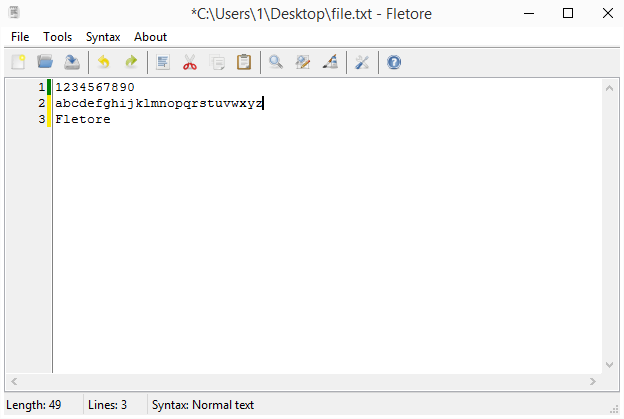

# Fletore
Fletore is a simple open-source text editor for Windows and \*NIX systems written in [Lazarus](https://lazarus-ide.org).
 
Fletore does not need to be installed. This program is distributed in a single executable file, but creates a configuration file.  
[Tango icon theme](http://tango.freedesktop.org) used
 
#
### Important information!
Fletore builds for Linux-aarch64, NetBSD, OpenBSD and Solaris were not tested because the Fletore's author does not have machines with these operating systems and cannot virtualize them.
 
#
### How can I build Fletore from source?
To build Fletore you need the [Lazarus Development Environment](https://lazarus-ide.org). 
To cross-compile Fletore you need Lazarus and [fpcupdeluxe](https://github.com/LongDirtyAnimAlf/fpcupdeluxe).
 
#
### Screenshot
 
[View more screenshots...](/screenshots)
