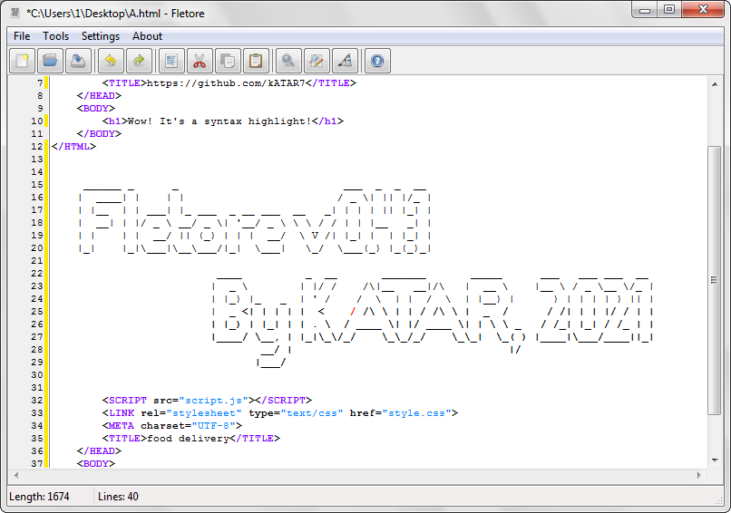

# Fletore
Fletore is a simple text editor written in Lazarus.
  
Fletore does not need to be installed. This program is distributed in a single executable file, but creates a configuration file.
 
#
### How do I build Fletore from source?
To build, you need the Lazarus development environment. 
  

